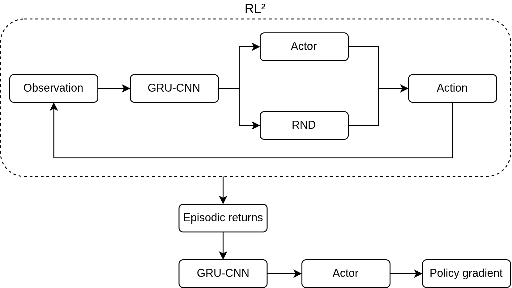

</img> 

**Vijñāna** (from Sanskrit, *"consciousness"*) is a proof-of-concept reinforcement learning system that, in essence, *learns to learn what to be curious about*. This repository accompanies my paper **“Temporal Meta-Curiosity via Recurrent Self-Reinforcing Intrinsic Meta-Learning”**.

At its core is the **Recurrent Intrinsic Meta-Learner (RIML)**, a novel architecture integrating curiosity-driven reinforcement learning with meta-learning and temporal encoding. The agent operates *without any extrinsic rewards*, relying solely on recursive novelty signals to structure its behavior.

https://github.com/user-attachments/assets/c3db445c-6700-4474-9474-7802276542ef

## 🧠 Philosophical Inspiration

The name *Vijñāna* draws from **Yogācāra** and **Madhyamaka** traditions in Buddhist philosophy:

- **Vijñaptimātra**: All reality is mere consciousness.
- **Pratītyasamutpāda**: All phenomena arise dependently - a philosophical precursor to *emergence*.

This project embraces the idea that intelligence may not be imposed from the outside, but may *emerge from within* through recursive curiosity and temporal deliberation.

---

## 🛠️ Implementation

Vijñāna leverages:

- **Random Network Distillation (RND)** for intrinsic reward generation  
- **CNN-GRU encoding** for spatiotemporal representation  
- **RL² meta-learning** for cross-episode adaptation  
- **No external rewards**, no hardcoded objectives  

The agent builds its own internal landscape of meaning over time - sometimes acting, sometimes *refusing to act*.  

> This is not a goal-seeking system.  
> It is an agent learning **how** to want.

---

## ⚠️ Note

This is an early-stage proof-of-concept.  
Expect imperfections, strange behaviours, and - at times - eerily emergent ones.
