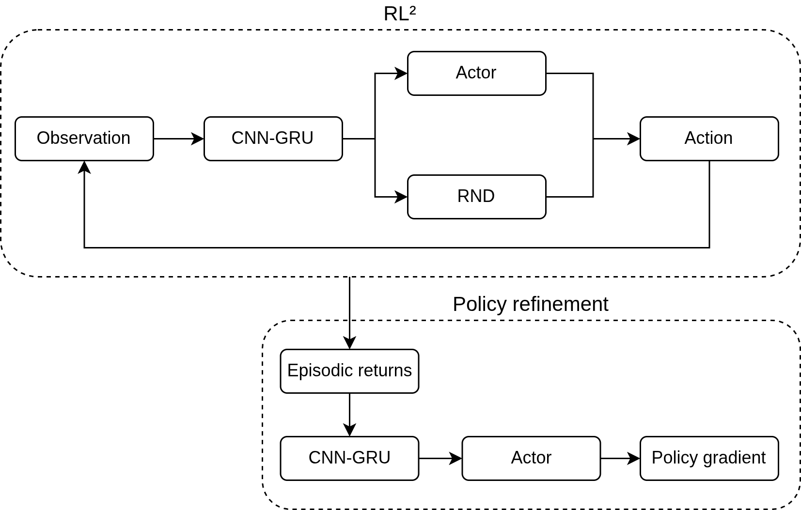

</img> 

Vijñāna (from Sanskrit, "consciousness") is a proof-of-concept, reinforcement learning-based system that, essentially, "learns to learn how to be curious". This is the companion code to the paper "Temporal Meta-Curiosity via Recurrent Self-Reinforcing Intrinsic Meta-Learning" and is an application of the proposed Recurrent Intrinsic Meta-Learner (RIML) architecture.

The project name draws inspiration from the Buddhist traditions of Yogācāra, which posits that the ultimate truth is that nothing exists beyond consciousness (vijñapti-mātra), and Madhyamaka, which states that all phenomena are empty of nature and are, instead, dependently co-arisen (pratītyasamutpāda), having a striking parallel to the notion of emergence. 

> As this project is meant to be a proof-of-concept, bugs and rough edges are to be expected.

## Implementation

Vijñāna leverages a mix of intrinsic curiosity-derived rewards, temporal encoding, and meta-learning to condition its own subsequent curiosity in the face of novel situations. There is no external goal-shaping - the system is to structure objectives on its own.

